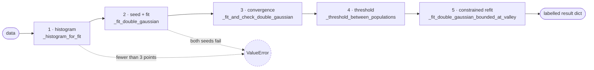
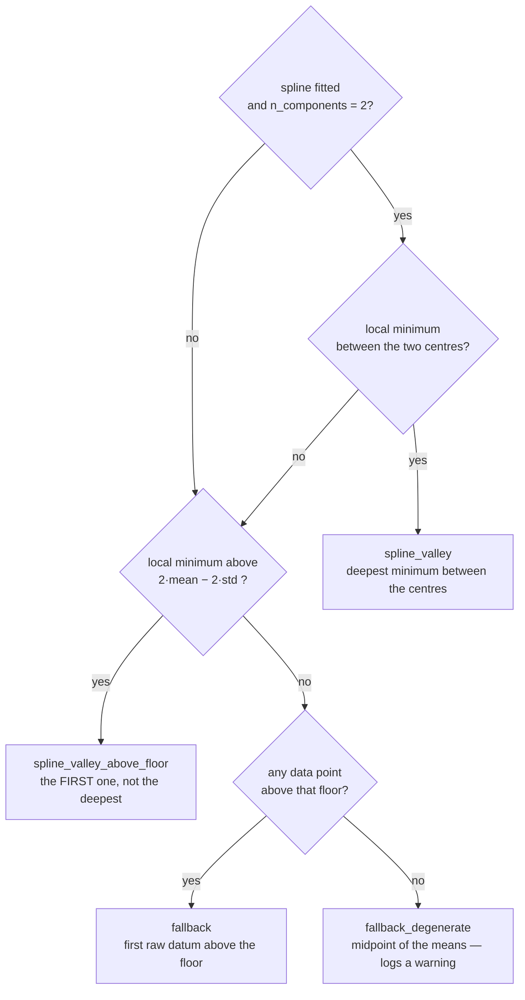
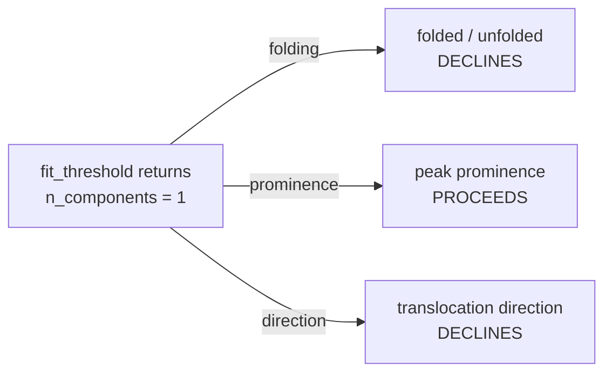

# Double-Gaussian fit: fallback map

Every way the shared `fit_threshold` chain in `poriscope/plugins/eventfitters/PeakFinder.py`
can degrade, what it degrades to, and how each of the three classifiers responds when it does.

Traced from the code, not summarised from `changelog.md`. Line-level behaviour.

## How to read this

All three classifiers — `_classify_folded_unfolded`, `_classify_peak_prominences`,
`_classify_translocation_direction` — call one function, `fit_threshold`, and it degrades
rather than fails. Every condition listed below substitutes a different method and carries
on, with exactly two exceptions — **the only two ways out of the chain that are not a
result**.

What makes that safe rather than sloppy is that a degraded fit is always *labelled*. Three
fields on the returned dict say how the answer was reached:

- `threshold_method` — which of four rungs produced the threshold
- `params_method` — whether the constrained refit ran or was declined
- `n_components` — whether the fit describes one population or two

A caller that ignores those three cannot tell a clean bimodal fit from a last-resort midpoint.

**The thing to internalise:** the fit chain hardly ever refuses. It is the *classifiers* that
decide a labelled-but-degraded fit is not good enough to act on, and they do not all decide
the same way.

The two dashed edges are the only paths out of the chain that are not a result. Stage 5 runs
only when stage 4 produced a spline-derived threshold.

## Stage 1 — histogram

`_histogram_for_fit`. Bin *width* from the Freedman–Diaconis rule on the interquartile range,
bin *range* from min-to-max. Those two do not degrade gracefully together, which is the origin
of more than one problem downstream.

| | Condition | Result |
|---|---|---|
| degrades | FD suggests fewer than `MIN_FIT_BINS` bins | Raised to the 30-bin floor, debug log. Six free parameters are underdetermined below that — the rule alone gives 3 bins at n=60 and 7 at n=600 |
| **aborts** | Fewer than 3 data points | `ValueError`, propagates out of `fit_threshold` to the classifier's own `try`/`except` |

The floor only ever *raises* the bin count. It cannot help when the count is high but the two
populations occupy few of those bins — which is exactly what a handful of extreme outliers
does, since they stretch the range while the IQR-derived width barely moves. See
`DIRECTION_FIT_PERCENTILES` for the one classifier that guards against this at its input.

## Stage 2 — seeding and the bounded fit

`_fit_double_gaussian`, which tries two entirely different initial guesses before giving up.
Both are fitted against the same box in `_curve_fit_bounded`: amplitudes in `[0, tallest bin]`,
means inside the histogram, widths between half a bin and the full span. The half-bin lower
width bound matters — at `std == 0` the model divides by zero and the component silently
vanishes from the curve carrying a `nan` onto the plot.

| | Condition | Result |
|---|---|---|
| degrades | `_resolve_two_histogram_peaks` returns `None` — no two maxima clear 5% prominence *and* sit at least one dominant-FWHM apart | Falls to the split-histogram seed: walk in from both ends to the first bin at 5% of maximum, split that support in half, take the argmax of each side. Structurally yields one seed per half, so it stays sane on a single broad mode |
| degrades | The peak-seeded `curve_fit` raises `RuntimeError` or `ValueError` | Same split-histogram seed. The two triggers are indistinguishable from outside — both arrive at the identical second attempt |
| **aborts** | The split seed also fails, or the support cannot be split at all (`left_start >= right_start`) | Returns `(None, None)`, which stage 3 turns into a `ValueError` out of `fit_threshold` |

## Stage 3 — convergence and diagnostics

`_fit_and_check_double_gaussian` is deliberately permissive: **only convergence failures
reject.** A fit that converged but looks statistically questionable is passed through and
flagged, on the reasoning that a silently discarded fit is indistinguishable from data that
never had two populations in it — and the failure rate on real recordings is worth being able
to see.

| | Condition | Result |
|---|---|---|
| **aborts** | No parameters returned, or the covariance matrix holds `inf`/`nan` | Returns `None`; `fit_threshold` raises `ValueError`. Debug log only, so the visible failure is the classifier's own error line |
| degrades | Either fitted std ≤ one bin width — a collapsed component | Fit kept, `n_components = 1`, warning naming the component. The fit is a single Gaussian wearing two sets of parameters, so any midpoint threshold is meaningless |
| degrades | Centre separation < `SEED_SEPARATION_FWHM` × the narrower component's FWHM | Fit kept, `n_components = 1`, warning. Catches what the collapse test misses: two components of comparable, non-degenerate width sitting on top of each other |
| logged | Any parameter's standard error exceeds 10× its value | Warning only, deliberately **not** folded into `n_components` — it also fires on genuinely bimodal but small or heavily overlapping data, which is a precision problem rather than a population-count one |

## Stage 4 — threshold placement

`_threshold_between_populations` carries *two independent* fallback chains.

### The spline chain

Runs first and unconditionally. Nothing consumes the resulting spline today; it and its local
minima are returned because they are the natural starting point for improving the fits
themselves, which is a better use than the plot overlay it was originally added for.

`_trim_to_populated_core` restricts the histogram to the contiguous span holding
`SPLINE_FIT_DOMAIN_COVERAGE` of the counts, padded two bins. It returns the histogram
unchanged when there are fewer than 4 bins, no counts at all, or the trim would leave fewer
than 4 bins.

| | Condition | Result |
|---|---|---|
| degrades | No rung of the λ ladder is quiet enough, or the histogram has fewer than 4 bins, an empty bracket, a non-positive x-range, or the fit raises | `spline = None`. Both spline-derived threshold rungs below are skipped and placement drops straight to the data-driven fallbacks |

**There is deliberately no fallback curve here.** An earlier revision fell back to plain
generalized cross-validation when the ladder declined, justified as being better than no
curve *for the plot*. There is no longer a plot — the spline overlay was removed — and GCV is
precisely what the ladder exists to replace: it under-smooths on counting data, leaving
Poisson wiggles the valley search cannot distinguish from a real boundary. Placing a
threshold from a GCV curve is not a degraded answer, it is a wrong one carrying the good
rung's label.

The ladder aims at whichever bracket is about to be searched — between the two centres
normally, above the floor on single-population data — since what matters is that the curve is
quiet where a valley will be looked for, not that it is quiet everywhere.

### The threshold chain

Tried strictly in order. This is what `threshold_method` reports.

- **`spline_valley`** is skipped entirely when `n_components = 1`. Both fitted centres then sit
  on the same mode, and the bracket between them contains no boundary between anything — but
  it is not empty. Beside a tall peak the spline wiggles on counting noise alone, and the
  search will happily return one of those wiggles.
- **`spline_valley_above_floor`** takes the *first* minimum above the floor, not the deepest.
  Past the bulk of the data every wiggle is a local minimum: one real 6261-peak dataset had 43
  in total and 30 above the floor, the deepest sitting at a spline value of −0.29 — below zero
  counts, out in the noise.
- **`fallback`** and **`fallback_degenerate`** are not read off any feature of the curve, which
  is why stage 5 refuses to constrain against them.
- `fallback_degenerate` is the only rung in the whole chain that logs at warning level.

**A threshold is always returned.** All four paths return a float; there is no `None` case.

## Stage 5 — constrained refit

`_fit_double_gaussian_bounded_at_valley` re-fits both components with each mean hard-bounded
to its own side of the threshold, then replaces the threshold with the analytic crossing of
the two resulting curves. It is attempted **only** when `threshold_method` is `spline_valley`
or `spline_valley_above_floor` — constraining against a threshold that was not read off the
curve would carve a single mode arbitrarily in half.

All five decline paths have the same consequence: `params_method` stays `"joint"`, and the
caller keeps the unconstrained fit and its original threshold. Nothing is lost but the
refinement.

| Condition | Log level |
|---|---|
| The split point falls outside `[bins[0], bins[-1]]` | debug — the only one of the five that is not a warning |
| `scipy.optimize.minimize` raises | warning, with the exception text |
| SLSQP reports failure **and** the result violates a constraint or bound | warning |
| Either refitted std ≤ one bin width | warning |
| `_gaussian_intersection` finds no crossing between the two means | warning, "this should not happen" |

Note the conjunction on the third row. A solution flagged unsuccessful but in fact **feasible
is accepted**: SLSQP reports a spurious `Positive directional derivative for linesearch` when
the optimum sits exactly on a constraint boundary, which is precisely where this fit is
expected to land whenever `_valley_separation` is what holds the higher component off the
valley. Seeding infeasibly threw away 3 of 12 otherwise-fine fits on skewed data before the
seed was walked into the feasible region first.

`_gaussian_intersection` itself returns `None` when either amplitude is non-positive, when the
equal-variance case degenerates (both quadratic and linear coefficients vanish), when the
discriminant is negative, or when no root lands between the two means.

## Reading a fit's provenance

| Field | Value | What it tells you |
|---|---|---|
| `threshold_method` | `spline_valley` | Read off a real valley between two fitted modes. The good case |
| | `spline_valley_above_floor` | No valley between the centres; first minimum above `2·mean − 2·std`. Normal and correct on single-population data |
| | `fallback` | No spline feature at all — the first data point above the floor. Stage 5 is skipped |
| | `fallback_degenerate` | Nothing above the floor; midpoint of the means. Last resort, logs a warning |
| `params_method` | `constrained` | The refit ran; `threshold` is the analytic crossing of the two bounded curves |
| | `joint` | The refit was skipped or declined; parameters and threshold are the unconstrained ones |
| `n_components` | `2` | No collapse, centres more than one FWHM apart |
| | `1` | A component collapsed, or both centres sit on one mode. **This is the field the classifiers branch on** |

## Classifier response

The fit chain hands back an identical dict to all three callers. What happens next is not
identical, and the asymmetry is deliberate.

Prominence is the odd one out on purpose. "Folded" and "forward" are claims about a second
population that was not found, but "more prominent than this one population accounts for"
remains a meaningful statement even when only one population exists.

| Condition | Folded / unfolded | Peak prominence | Translocation direction |
|---|---|---|---|
| No usable input | never reached — the caller checks first | returns early: no peaks with filter 1, 2 or 3 | `skipped`, reason `"no data"` |
| `fit_threshold` raises | `error: "double-Gaussian fit failed"` | logs an error and returns; no peak classified | `skipped`, reason `"fit failure"` |
| Missing threshold or centres | `error: "fit insufficient results"` | raises `RuntimeError` (see below) | raises `RuntimeError` (see below) |
| Fewer than two centres | `error: "Could not find two distinct distributions"` | proceeds — centres are not required to split | `skipped`, reason `"insufficient centers"` |
| `n_components = 1` | `error: "only one population detected; cannot classify folded vs unfolded"` | **proceeds**, logging that the threshold came from the above-floor rung | `skipped`, reason `"only one population detected"` |

Each folded/unfolded decline also calls `_collect_peak_statistics` before returning, so the
peak-filtering section of the report is still populated.

### Knock-on effects

- A **folding** decline means no event gets an `unfolded_level` or `folded_level`. `bound_star`
  then has no depth floor to test candidates against and counts every sequence-bearing event
  under `no_height_reference`.
- A **direction** decline means no event gets a `translocation_direction`. Sequences are not
  reversed into the molecule's frame, and `bound_star` stays `None` for every event.
- A **prominence** decline means peaks keep `classified = nan`, so sequence strings come out
  empty and every downstream count keyed on sequence goes to zero.

## The one classifier with input-level fallbacks

`_classify_translocation_direction` is the only one that pre-processes its input before
fitting. It estimates the fit from the `DIRECTION_FIT_PERCENTILES` core of the log-ECD ratio
but classifies **every** event against the resulting threshold, so the trim never decides who
gets a direction — only what the fit is estimated from.

| | Condition | Result |
|---|---|---|
| degrades | The percentile core comes out below `MIN_FIT_BINS` | No trim; the whole array is fitted. A degenerate distribution piled on one value does this, and trimming there swaps one bad fit for another. This is the only gate the trim needs — the core is ~90% of the sample, so reaching the floor already requires 34 events |

This exists because stage 1's bin *range* is not outlier-robust while its bin *width* is.
Measured on a real distribution (n=690, centres −0.307 and 0.385): the two populations span 25
bins clean, 11.8 with one event two decades out, and 6.8 with three — landing squarely in the
regime `_histogram_for_fit`'s own docstring records as underdetermined, where the fit can
converge with both Gaussians on the same mode while passing every convergence check.

## Guards that cannot fire

Each of these looks like a live fallback and is not. Knowing which is which saves an afternoon
when something does go wrong.

- **A `None` threshold.** Both the prominence and direction classifiers raise `RuntimeError` if
  `bt["threshold"]` comes back `None`. It cannot: `_threshold_between_populations` returns a
  float on all four of its paths, the last being an unconditional midpoint. The guards are
  inherited from an older signature.
- **No crossing after the dominance constraint.** Stage 5's final decline is guarded by a
  constraint that mathematically guarantees the two curves cross between their means — that is
  the same condition, derived in `_gaussian_intersection`'s docstring. Its warning text says as
  much.
- **The 5%-of-maximum walk running off the end.** In the split-histogram seed, the bounds test
  precedes the index test so that a histogram where no bin reaches 5% of maximum walks off the
  end rather than raising `IndexError`. The argmax bin always clears that floor for a real
  histogram.

## Constants

All are class attributes on `PeakFinder`. Several carry the measurements behind their values in
their own comments.

| Constant | Value | Governs |
|---|---|---|
| `MIN_FIT_BINS` | 30 | Stage 1 bin floor; also the minimum size of the direction fit's percentile core |
| `SEED_SEPARATION_FWHM` | 1.0 | Peak separation for stage-2 seeding, and the centres-not-separated test in stage 3 |
| `VALLEY_SEPARATION_SIGMA` | 0.5 | How far the valley must sit from each mean, in that component's own σ, in stage 5 |
| `SPLINE_MAX_MINIMA` | 1 | The λ ladder's acceptance criterion — *at most* this many, so zero is fine |
| `SPLINE_LAMBDA_SHAPE_MIN` | 1e-12 | Bottom of the ladder (almost no smoothing) |
| `SPLINE_LAMBDA_SHAPE_MAX` | 1e2 | Top of the ladder |
| `SPLINE_LAMBDA_CANDIDATES` | 50 | Log-spaced rungs between those two |
| `SPLINE_LAMBDA_MARGIN_STEPS` | 0 | Extra smoothing past the first acceptable rung. Kept at zero deliberately — two steps of "safety margin" drove the higher component's mode bias from +22 pA to +685 pA and made 5 of 24 fits fail outright. The constant exists so the finding is not rediscovered |
| `SPLINE_FIT_DOMAIN_COVERAGE` | 0.995 | Fraction of counts the populated-core trim must retain |
| `DIRECTION_FIT_PERCENTILES` | (5.0, 95.0) | The core the direction fit is estimated from — never what gets classified |

## Maintaining this file

Update it whenever a fallback is added, removed, or changes what it degrades to, whenever a
classifier changes how it responds to a degraded fit, and whenever one of the constants above
changes. A stale fallback map is worse than none — it is read precisely when something has
gone wrong and the reader is trying to work out which path was taken.
